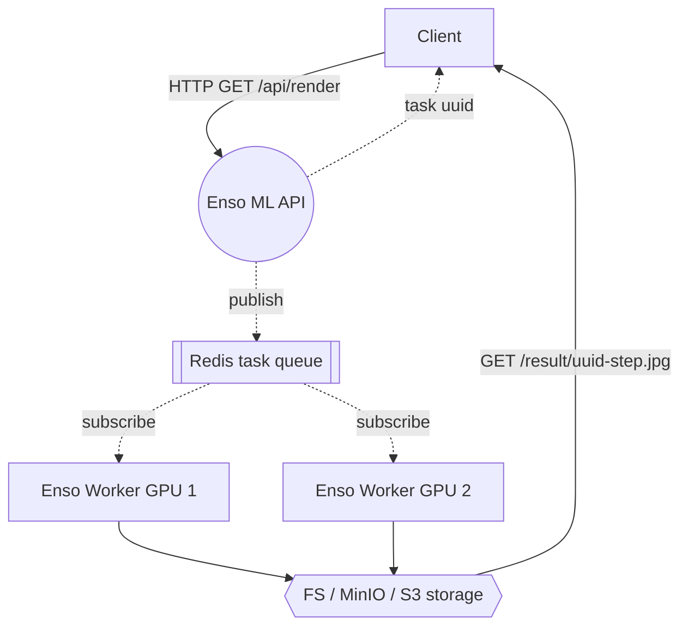
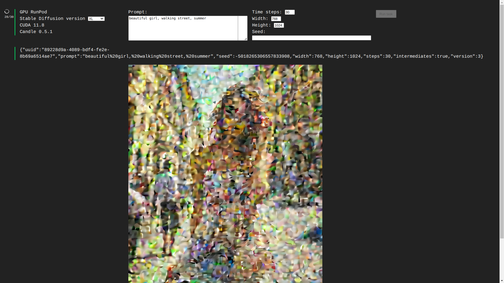
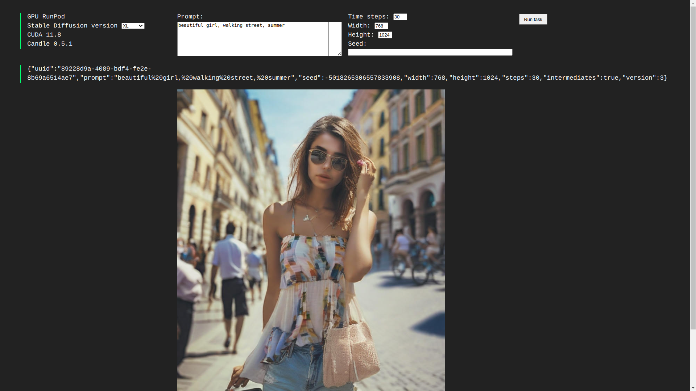

# enso-ml-net

A PoC of simple asynchronuous json API for running ML-models tasks via Redis queue.

> Pipelines based on `huggingface/candle` ML framework (https://github.com/huggingface/candle)


### Principle schema

### API
 > `GET /render/?prompt=Some+prompt`
  * required fields:

| parameter | meaning  |
|-----------|----------|
| `prompt`  | *string* |

  * avaiable fields:

| parameter       | meaning                                    | default value          |
|-----------------|--------------------------------------------|------------------------|
| `seed`          | *signed 64-bit integer*                    | *64-bit random number* |
| `width`         | *unsigned 32-bit integer*                  | 768                    |
| `height`        | *unsigned 32-bit integer*                  | 768                    |
| `steps`         | *unsigned 8-bit integer* in range `[1-50]` | 24                     |
| `version`       | *unsigned 8-bit integer* in range `[1-4]`  | 3 (*SDXL 1.0*)         |
| `intermediates` | *bool*                                     | true                   |

    
  * result is a JSON-representation of a task:
    ```
    {
        "uuid":"44aecf11-69f2-3d5e-7617-52b2c6bb80a8",
        "prompt":"beauty%20and%20the%20beast",
        "seed":-3321392915133399677,
        "width":768,
        "height":768,
        "steps":24,
        "intermediates":true,
        "version":3
    }
    ```
  * `uuid` can be used to fetch result image for every step like `/result/{uuid}-{step}.jpg`
> `GET /api/health`
  * result:
```
{
  "status": false,
  "uuid": "2099f4ea-a10a-7162-96ea-88f80edd20aa",
  "has_cuda": true
}
```
### Usage with RunPod

* Create and run CPU Pod from official Redis image (`redis:latest` for example)
* Create pod with Enso ML community template (https://runpod.io/console/deploy?template=6b448rr6cb&ref=6isqvo6h)
* Set `ENSO_REDIS_HOST=redis://{REDIS_POD_URL}:{REDIS_POD_EXTERNAL_PORT}` variable in that template
* Now you can put the task to queue:
  * Get `/render/?prompt=some+prompt&steps=25&height=1024&width=768` to start processing
  * Take `uuid` field from response
  * Try to get `/result/{uuid}.jpg` while it becomes ready or try to see intermediatory timesteps like `/result/{uuid}-{step}.jpg`
    * At first time you should wait while weights will be downloaded from HuggingFace to Pod storage cache  
  * Also any such pod from this template can be tested by hands via simple debug GUI on `https://pod-url/`
    * it's pretty simple yet and looks like this:  
      
      


### Usage in local docker

* Clone this repository
* Run `docker-compose up --build -d` in root folder
* Run task:
  * `curl http://localhost:80/api/render/?prompt=Some%20prompt`

### TODO:

* [x] 1.5, 2.1, SDXL 1.0, SDXL Turbo support
  * [ ] using any weights from https://civitai.tech/ by uuid
  * [ ] LoRa support
* [ ] putting results to S3
  * [ ] fetch as Base64
* [ ] WebSockets for GUI progress & logging
* [ ] multiple GPU devices support
* [ ] load balancing / improving queues
* [ ] other various ML-pipelines from Candle 
  * LLMs
  * Yolo
  * SAM
  * &hellip;

# You can donate my work on this repository or some wanted features

> USDT/TRC20 address `TWwumLM9UXZbZdW8ySqWNNNkoqvQJ8PMdK`
